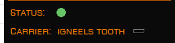
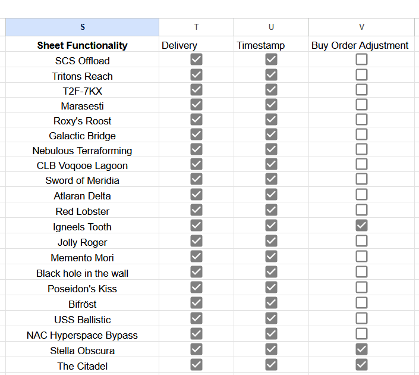

# Mercs of Mikunn: Colonisation Tracker Plugin

This [EDMC](https://github.com/EDCD/EDMarketConnector) plugin is designed to help any Mercs particpating in the building of the Grand Tiberian Highway by doing most of the admin work of keeping the spreadsheet updated for you.

## Features

#### Carrier Owners
* Automatically set/update buy orders in the spreadsheet when setting them on the carrier
  * >See **Buy Order Adjustments** in the Settings controlled via spreadsheet section below for additional configuration
* Automatically updates the **Current System** cell whenever a CMDR docks
* Automatically updates the **Scheduled Jump** cell whenever a jump is scheduled

#### Individual CMDRs
* Automatically adds an entry to the relevant carrier sheet when buying or selling something from/to the carrier
* Automatically adds an entry to the SCS Offload sheet when 'selling' cargo the the System Colonisation Ship
* Automatically keeps CMDR Cargo capacity on the System Info tab up to date
* [1.2.0] () Automatically adds an entry to your the selected carrier's sheet when buying a commodity
* [1.2.0] Automaticlaly updates the System Info sheet when docking
* [1.3.0] Automatically adds correction entries to the SCS Offload sheet when docked to the SCS to keep the sheet closer insync with whats happening in game
* [1.3.0] Automatically adds an entry to the System Info sheet when deploying a Beacon
* [1.3.0] Automatically updates the Data sheet when docking to a SCS for the first time

#### General
* [1.2.0] (**WIP**) Plugin Widgets
  
  
  
  * **Status**
    * Green indicator when connected to the spreadsheet
    * Red indicator when an error has occurred
   * **Carrier**
     * A dropdown containing the known list of carrier (sheets). Used to indicate which carrier delivery tracking entries should be added to

## Settings
### Controlled via the spreadsheet

* Delivery (Tracking)
  > Controls whether the Delivered column on the relevant Carrier sheet should be populated or not. If set to False then the cell will remain blank when adding a new row to the carrier tab
* Timestamps
  > Controls whether the Timestamp coilumn on the relevant Carrier sheet should be populated or not. If set to False then the cell will remain blank when adding a new row to the carrier tab
* Buy Order Adjustment
  > If setting Buy Orders based on the Proportional value alone is desiered then leave this as false. If, however, you are setting the Buy Orders excluding whats already on the carrier, then this should be set to true to keep the Totals lined up.

  > When this is set to True, then the Buy Order value added to the top table is adjusted by the amount of cargo already existing on the Carrier. For example, if you have **50** steel left on the carrier, and a Buy Order set in game to **1000**, then the Buy Order added to the table will be **1050**.

### Controlled individually via the plugin

* Show Connection Status
  > Set to False to hide the Status widget 
* Show Currently Assigned Carrier
  > Set to False to hide the Carrier widget
* Delivery Tracking
  > Set to False to not send delivery tracking information as part of the carrier update message. If not currently working on the highway, then use this to stop sending 'in-transit' messages
* Assume Carrier Buy is for Unloading to SCS
  > When buying from a Carrier in a system thats known to have an SCS in it, then assume the delivery is going to the SCS

## Installation Instructions
1. Install [EDMC](https://github.com/EDCD/EDMarketConnector/releases) if you haven't already done so
1. Configure EDMC with some required settings
   - On the Configuration tab, ensure **Enable Fleet Carrier CAPI Queries** is selected (important for Carrier owners)
   - On the Output tab, ensure **Automatically update on docking** is selected
1. On the Plugins tab ios a button to quickly open the EDMC plugins folder - click that 😉 (or at the very least, note the plugins folder path)
   > There are some reports of this not being populted, or the button not working on Linux/Steam Deck. See EDMCs [More-Info](https://github.com/EDCD/EDMarketConnector/wiki/Plugins#more-info) for the default locations
1. Download the latest plugin from [Releases](https://github.com/meeces2911/edmc-mom-colonisation-plugin/releases/latest)
1. Extract the zip file to the location noted in step 3
   > The folder structure should look like: **EDMarketConnector\plugins\mom_colonisation_tracker\load.py**
1. Save and close the EDMC settings dialog if you haven't already
1. If the Frontier OAuth screen has appeared, sign into that and confirm access
1. Close and **restart** EDMC
1. A Google OAuth screen should open in your web browser, sign into that and confirm access
   > There are some reports of this page not loading correctly on Linux/Steam Deck if the browser isn't already open. To work around this, make sure the default web browser is open before launching EDMC. The OAuth screen should then open in a new tab.
1. A second Google screen should open, asking you to pick the **MERC Expantion Needs** sheet. Select that and confirm access.

## Troubleshooting
- Check the plugin is installed correctly.
   - After restarting EDMC, you can go back into Settings and select the Plugins tab. You should now see **mom_colonisation_tracker (MoM: Colonisation Tracker)** included under the list of Enabled Plugins.
      
      

- If the plugin has loaded successfully, you should bee an extra **MoM: Colonisation Tracker** tab.
   

- If the plugin is running, but dont doing something correctly, try changing the Log Level on the first **Configuration** tab to DEBUG, reproduce the issue, and then send me the log file to look at. (or check it out yourself... I'm logging *quite* a bit 😜)
   - You can click the **Open Log Folder** button for a quick shortcut to get to the logs folder.
      